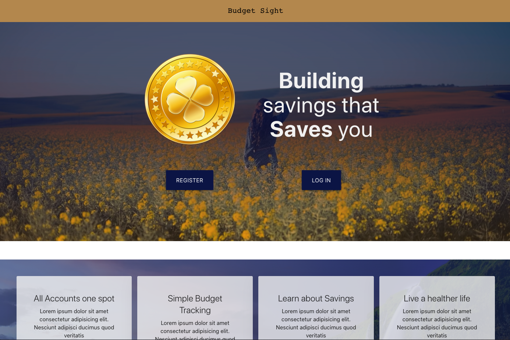
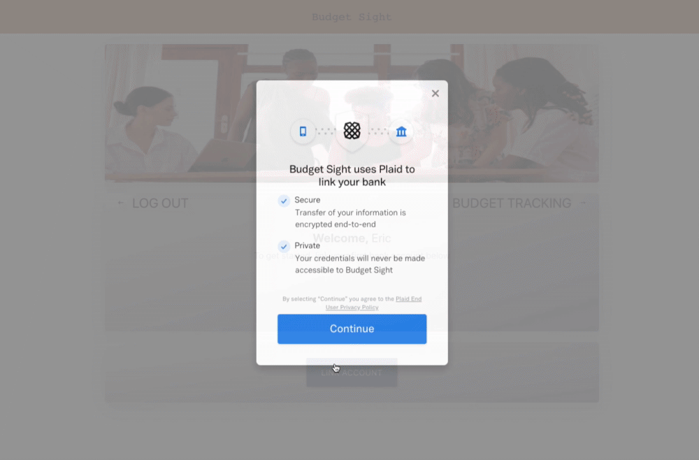
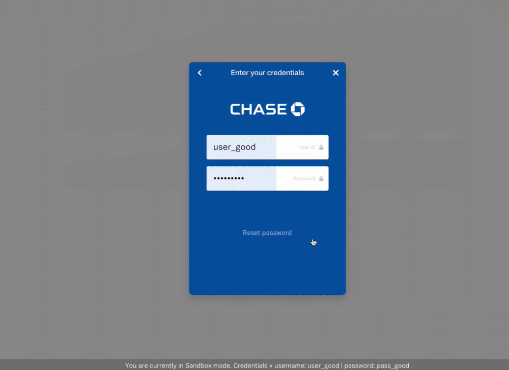

# Descrption
This Full stack Mern APP is a finance tracking application using Plaid api in order to combine all of your bank account in one spot. This app also has a expense tracking fueature, so the user will be able to budget their expenses. Passport user authentication that using Javascript Web Tokens has been include for user authentication

<br />




## Demo
check out a demo of this app [Here](https://budget-sight.herokuapp.com/ "Demo")

<br />



<br />



## Technologies Used
 | [Mongo](https://www.mongodb.com/ "Mongo")  | [Express](https://expressjs.com/ "express") | [React](https://reactjs.org/ "React") | [Node](nodejs.org "Node") | [Redux](https://redux.js.org/ "Redux") | [passport](http://www.passportjs.org/ "Passport") |[bcrypt](https://www.npmjs.com/package/bcryptjs "bcrypt") | [Json web token](https://www.npmjs.com/package/jsonwebtoken "JWT") | [materialize](https://materializecss.com/ "Materialize")  | 
 [mathjs](https://www.npmjs.com/package/mathjs/ "MathJs") | [react-calendar](https://www.npmjs.com/package/react-calendar/ "react-calendar")

## Usage and Installation
* Feel free to clone or fork this repo if you find it useful. 

1. To install dependencies make sure to run: 
```npm install && npm run client-install```
2. When running locally make sure your Mongo DB is connected
```mongod```
```mongo```
3. In config/key.js add your db connection. Alternatively you can create an env file to hide your DB and secretOrkey
4. To run full app: 
```npm run dev```
5. Since I am keeping the Plaid API in sandbox mode. Plaid presets the username and password
to login to any account
Username: user_good
password: pass-good 


